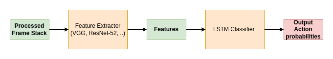

# Football Action Classification using CNN-LSTM

This document discusses about the methodologies employed in data preparation and model building processes for the classifying football events. We mainly focused on three events namely Throw-ins, Yellow cards & Corners.

## Dataset

SoccerNet[[1]](#References) is a large-scale dataset mainly created for soccer video understanding. Over the years, data is been labelled for various tasks such as action spotting, camera calibration, player re-identification and tracking. It is composed of `550 complete broadcast soccer games` and `12 single camera games` taken from the major European leagues. SoccerNet is not only dataset as it's maintainers also conduct yearly challenges where the best teams compete at the international level conferences.

We focused on dataset related to action-spotting task. It contains `17 actions` or events are labelled with respective timestamps stored in `json` format for every match. The `17 labelled actions` in the dataset are shown below,

<table align="center">
    <tr>
        <th></th>
        <th>Actions</th>
        <th></th>
        <th></th>
    </tr>
    <tr>
        <td>Penalty</td>
        <td>Kick-off</td>
        <td>Goal</td>
        <td>Substitution</td>
    </tr>
    <tr>
        <td>Offside</td>
        <td>Shots on target</td>
        <td>Shots off target</td>
        <td>Clearance</td>
    </tr>
    <tr>
        <td>Ball out of Play</td>
        <td><b>Throw-in</b></td>
        <td>Foul</td>
        <td>Indirect free-kick</td>
    </tr>
        <td>Direct free-kick</td>
        <td><b>Corner</b></td>
        <td><b>Yellow card</b></td>
        <td>Red card</td>
    </tr>
    </tr>
        <td>Yellow -> Red card</td>
        <td></td>
        <td></td>
        <td></td>
    </tr>
</table>

Out of `17 actions`, we focused on identifying three action namely `Throw-in`, `Corner` & `Yellow card`.

## Data statistics

We have manually watched some soccer matches and noted down the event or action time stamp & it's duration. Below statistics have been computed to get understanding on duration of the event or action,

<table align="center">
    <tr>
        <th>Event or Action</th>
        <th>Duration(mean)</th>
        <th>Duration(std. dev.)</th>
        <th>Action clip(start)</th>
        <th>Action clip(end)</th>
    </tr>
    <tr>
        <td>Yellow Card</td>
        <td>0.909</td>
        <td>0.437</td>
        <td>TS + 0.0352</td>
        <td>TS + 1.782</td>
    </tr>
    <tr>
        <td>Red Card</td>
        <td>0.909</td>
        <td>0.437</td>
        <td>TS + 0.0352</td>
        <td>TS + 1.782</td>
    </tr>
    <tr>
        <td>Throw-in</td>
        <td>1.5</td>
        <td>1.090</td>
        <td>TS + 0.0694</td>
        <td>TS + 2.130</td>
    </tr>
        <td>Corner</td>
        <td>1.1</td>
        <td>0.515</td>
        <td>TS - 0.6803</td>
        <td>TS + 3.680</td>
    </tr>
</table>

**Note**

- Duration(mean) & Duration (std. dev.) are in sec's
- `TS` denotes timestamp at which event or action occurs.
- For more information on event or action statistics, check it out [here](https://docs.google.com/spreadsheets/d/1MlLQifW1cku9VNuCqNe8ouMT92ChKka1_5lXDSMLB4Q/edit?usp=sharing).

From statistics, we got conclusion that the events we are trying to classify occupies a duration of `2-4 sec’s` but we took `4 sec's` as a standard. Also, we computed the start and end of the event/action clip which ranges from `[label timestamp-1, label timestamp+3]`. Finally, this ensures that event/action clip that captures most relevant information.

## Data preparation

We have created a handy script which uses ffmpeg to extract the action or event clips using the action spotting labels from the football match broadcast video. Finally, all the extracted action or event clips are stored in the directory respective to their action and their match.

A total of over `500 action clips` were extracted from `28 full matches` but due to available computational resources, we have took `360 action clips` with equal class distribution i.e `Throw-in:Corner:Yellow-card = 120:120:120`.

## Data preprocessing

A unit action video clip details are as follows,
- Resolution: `1280x720`
- Duration: `4 sec's`
- FPS: `25 fps`

For each action clip we employed following preprocessing strategy,
- We took alternate frame (by sampling) which results to `50 images`.
- Resizing to a resolution of `224x128` followed by normalization have been done to preprocess them.

<table align="center">
   <tr>
      
   </tr>
   <tr>
      preprocessing pipeline
   </tr>
</table>

At the end of preprocessing, A tensor of size `(360x50x128x224x3)` i.e `(no of clips x 50 frames per clip x height of frame x width of frame x rgb channels)` is stored as pickle on disk.  

The dataset distribution of `train : test =  90% : 10%` is been employed while storing.

## Model building

**Architecture**

<table align="center">
   <tr>
      
   </tr>
   <tr>
      model architecture
   </tr>
</table>

- Keras[[2]](#References) deep learning framework is chosen to write for it's ease of experimentation and readability.
- In source code, we have made an option to use either `VGG-16`[[3]](#References) or `ResNet-52`[[4]](#References) as a feature extractor.
- Both feature extractors are loaded with weights pretrained on `imagenet`[[5]](#References) dataset.
- `LSTM classifier` contains `128` hidden units.
- Finally, a `softmax layer` gives class probabilities for `three events` as output.

**Source code**

Checkout entire project's source code in this [Github repository](https://github.com/saipjkai/fac-cnnlstm) for implementation and additional details. 

**Training machine specifications**

We have trained deep learning network on work laptop with following specifications,

<table align="center">
    <tr>
        <th>Hardware</th>
        <th>Value</th>
    </tr>
    <tr>
        <td>CPU</td>
        <td>Intel i5-10300H (8) @ 4.500GHz</td>
    </tr>
    <tr>
        <td>GPU</td>
        <td>NVIDIA GTX 1650</td>
    </tr>
    <tr>
        <td>Memory</td>
        <td>15830 MB</td>
    </tr>
        <td>SSD</td>
        <td>512 GB</td>
    </tr>
</table>

## Results

These are the results on test dataset,

<table align="center">
    <tr>
        <th>Metrics</th>
        <th>VGG16<a href="#References">[2]</a></th>
        <th>ResNet52<a href="#References">[3]</a></th>
    </tr>
    <tr>
        <td>AUC score</td>
        <td>0.8573</td>
        <td>0.8017</td>
    </tr>
    <tr>
        <td>Confusion matrix</td>
        <td></td>
        <td></td>
    </tr>
    <tr>
        <td>Accuracy</td>
        <td>0.639</td>
        <td>0.583</td>
    </tr>
</table>

## Conclusion

These are some of the findings of this work,
- Trained model is able to identify the three events from Soccer with False Positives. Along, with the identified event, the timestamps i.e `start and end timestamp` of the event are also being stored. 
- The FPs are low when the feature extractor is `VGG16`[[2]](#References) compared to the `ResNet52`[[3]](#References).
- The LSTM effect on the output prediction diminishes if the `no. of hidden units > 128`.
- Good Confusion matrix metrics with `VGG16`[[2]](#References) feature extractor.
- Due to memory and GPU limitations, the overall dataset consists of `360 clips` and it's been increased from `150 clips`. After training on this increased dataset, there were less number of FPs.
- Normalizing the images helped in increasing the `batch size` while training leading to faster training process.

## Future work

The results are convincing with the current framework although there were false positives. So, in future we would like to explore some more methods involving late fusion, 3D conv. nets,  combining audio and video features, etc,.

## Acknowledgements

This work is been carried out at Konverge.ai during December as a part of AI capability team. My sincere thanks Kalpit B. for his constant guidance and Pooja M. for managing entire team. I am grateful to the colleagues who are working in different projects and sharing knowledge.  

## References

[1] &nbsp; Giancola, Silvio, Mohieddine Amine, Tarek Dghaily, and Bernard Ghanem. "Soccernet: A scalable dataset for action spotting in soccer videos." In Proceedings of the IEEE conference on computer vision and pattern recognition workshops, pp. 1711-1721. 2018.

[2] &nbsp; Simonyan, Karen, and Andrew Zisserman. "Very deep convolutional networks for large-scale image recognition." arXiv preprint arXiv:1409.1556 (2014).

[3] &nbsp; He, Kaiming, Xiangyu Zhang, Shaoqing Ren, and Jian Sun. "Deep residual learning for image recognition." In Proceedings of the IEEE conference on computer vision and pattern recognition, pp. 770-778. 2016.

[4] &nbsp; Deng, Jia, Wei Dong, Richard Socher, Li-Jia Li, Kai Li, and Li Fei-Fei. "Imagenet: A large-scale hierarchical image database." In 2009 IEEE conference on computer vision and pattern recognition, pp. 248-255. Ieee, 2009.

[5] &nbsp; https://keras.io/
